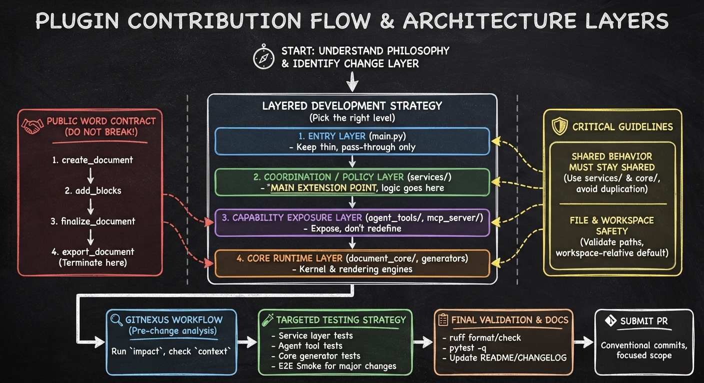

<p align="center">
  
</p>

# 📁 Office 助手（astrbot_plugin_office_assistant）

一个给 AstrBot 用的「文件魔法工房」插件。目标很直接：让机器人更稳地读文件、做文档、跑转换。

它主要做三件事：

1. 让模型读取并分析文件内容（文本 / 代码 / Office / PDF）。
2. 让模型按结构化内容生成 Word、Excel、PPT。
3. 提供 Office 与 PDF 的双向转换，并在发送时可附带预览图。

---

## 目录

- [🌟 快速了解](#快速了解)
- [🚀 快速开始](#快速开始)
- [⚙️ 配置说明](#配置说明)
- [🛠️ 工具与命令](#工具与命令)
- [🧭 复杂 Word 工作流](#复杂-word-工作流)
- [🗺️ 未来规划](#未来规划)
- [📚 支持的文件格式](#支持的文件格式)
- [🧱 系统依赖安装](#系统依赖安装)
- [🐳 Docker 使用建议](#docker-使用建议)
- [🛡️ 安全与行为说明](#安全与行为说明)
- [❓ 常见问题（Q/A）](#常见问题qa)
- [💬 社群答疑与新想法](#社群答疑与新想法)
- [🧭 升级与迁移说明](#升级与迁移说明)
- [📄 许可证](#许可证)
- [🤝 贡献](#贡献)

---

## 快速了解

当前版本的核心行为：

- 群聊默认不启用插件能力（`enable_features_in_group=false`）。
- 若群聊启用后，默认仍要求 `@` / 引用机器人才会暴露文件工具（`require_at_in_group=true`）。
- 默认会在插件能力生效时隐藏执行类工具：
  - `astrbot_execute_shell`
  - `astrbot_execute_python`
  - `astrbot_execute_ipython`
- 默认禁止读取工作区外路径；可通过配置开启外部绝对路径读取（仅对 `read_file`/PDF 转换生效）。
- 复杂 Word 走四步工具链：`create_document → add_blocks → finalize_document → export_document`，一个 `add_blocks` 搞定标题、正文、列表、表格、卡片、分页、分组、分栏。
- `create_office_file` 还在，但已标记 deprecated；复杂 Word 走四步链更稳。

---

## 快速开始

### 1 📦 安装插件（开箱）

通过 AstrBot 插件管理器安装即可。Python 依赖会随插件自动安装。

### 2 ✅ 启动后先做两条检查（验机）

- `/fileinfo`：查看插件当前运行状态与配置生效情况。
- `/pdf_status`（或 `/pdf状态`）：查看 PDF 转换可用性与缺失依赖。

### 3 🧪 最小可用验证（跑一遍就安心）

- 发一个 `.txt` 或 `.md` 给机器人，要求它读取并总结。
- 让机器人生成一个 `.xlsx`。
- 如果安装了转换依赖，再试一次 Office -> PDF。

---

## 配置说明

以下配置均在 AstrBot 管理面板中设置。

先看这几个最常改、最影响体验的项：

| 配置项 | 默认值 | 什么时候改 |
| --- | --- | --- |
| `enable_features_in_group` | `false` | 需要在群聊里启用插件时改。 |
| `require_at_in_group` | `true` | 群聊里不想强制 `@` / 引用机器人时改。 |
| `enable_docx_image_review` | `true` | 不希望模型读取 Word 里的嵌入图片，改成纯文本读取时改。 |
| `auto_block_execution_tools` | `true` | 不希望插件自动隐藏执行类工具时改。 |
| `allow_external_input_files` | `false` | 需要读取或转换工作区外绝对路径文件时改。 |
| `enable_pdf_conversion` | `true` | 不需要 Office/PDF 转换能力时改。 |
| `auto_delete_files` | `true` | 想保留生成文件而不是发送后删除时改。 |

> [!TIP]
> 如果只是先把插件跑起来，通常优先关注 `enable_features_in_group`、`require_at_in_group`、`allow_external_input_files` 和 `enable_docx_image_review` 这 4 项。

<details>
<summary>查看完整配置表</summary>

### 🔔 触发设置（`trigger_settings`）

| 配置项 | 类型 | 默认值 | 说明 |
| --- | --- | --- | --- |
| 群聊需要@/引用机器人 (`require_at_in_group`) | bool | true | 群聊中仅在 `@` / 引用机器人时暴露文件工具。 |
| 群聊启用插件功能 (`enable_features_in_group`) | bool | false | 关闭时，群聊里本插件完全不生效（工具/命令/文件拦截全部关闭）。 |
| 自动屏蔽 shell/python 工具 (`auto_block_execution_tools`) | bool | true | 开启后，在插件功能生效时自动隐藏 `astrbot_execute_*` 三个执行工具。 |
| 发送文件时@用户 (`reply_to_user`) | bool | true | 机器人发送文件时是否 `@` 发起人。 |

### 🔐 权限管理（`permission_settings`）

| 配置项 | 类型 | 默认值 | 说明 |
| --- | --- | --- | --- |
| 用户白名单 (`whitelist_users`) | list | [] | 允许使用插件的用户 ID；留空时仅管理员可用。 |

### 🧩 功能开关（`feature_settings`）

| 配置项 | 类型 | 默认值 | 说明 |
| --- | --- | --- | --- |
| 启用 Office 文件生成 (`enable_office_files`) | bool | true | 是否允许 `create_office_file`。 |
| 启用 PDF 转换 (`enable_pdf_conversion`) | bool | true | 是否允许 Office <-> PDF 转换（仍需系统依赖）。 |

### 📏 文件限制（`file_settings`）

| 配置项 | 类型 | 默认值 | 说明 |
| --- | --- | --- | --- |
| 最大文件大小MB (`max_file_size_mb`) | int | 20 | 读取/发送文件大小上限。 |
| 启用 Word 图片理解 (`enable_docx_image_review`) | bool | true | `read_file` 读取 `.docx` 时，是否把嵌入图片注入模型上下文。关闭后按纯文本读取，不再输出 `[插图N]`。 |
| Word图片注入大小上限MB (`max_inline_docx_image_mb`) | int | 2 | `read_file` 读取 `.docx` 时，单张嵌入图片超过该大小就不注入多模态上下文。 |
| Word图片最多注入张数 (`max_inline_docx_image_count`) | int | 3 | `read_file` 读取 `.docx` 时，最多向多模态上下文注入多少张嵌入图片。 |
| 发送后自动删除文件 (`auto_delete_files`) | bool | true | 发送后删除生成文件；关闭则持久化到插件工作区。 |
| 文件消息缓冲时间秒 (`message_buffer_seconds`) | float | 4 | 用于聚合“先发文件后发文本”的场景。 |

### 🛣️ 路径访问（`path_settings`）

| 配置项 | 类型 | 默认值 | 说明 |
| --- | --- | --- | --- |
| 允许外部绝对路径 (`allow_external_input_files`) | bool | false | 开启后，`read_file` / `convert_to_pdf` / `convert_from_pdf` 可访问工作区外绝对路径；`delete_file` 仍只允许工作区内删除。 |

### 🖼️ 预览图（`preview_settings`）

| 配置项 | 类型 | 默认值 | 说明 |
| --- | --- | --- | --- |
| 启用预览图 (`enable`) | bool | true | 发送 Office/PDF 时尝试发送第一页预览图。 |
| 预览图分辨率 (`dpi`) | int | 150 | 推荐 100~200。 |

</details>

---

## 工具与命令

### 🤖 LLM 工具

| 工具名 | 作用 |
| --- | --- |
| `read_file` | 读取文本、代码、Office、PDF 内容。 |
| `create_office_file` | 生成 Word / Excel / PPT（已 deprecated，Word 建议走四步链）。 |
| `create_document` | 建 Word 草稿会话，定主题、表格模板、密度和强调色。 |
| `add_blocks` | 往草稿里追加内容块：heading / paragraph / list / table / summary_card / page_break / group / columns。 |
| `finalize_document` | 草稿定稿。 |
| `export_document` | 导出 .docx，插件自动发给用户。 |
| `convert_to_pdf` | Office → PDF。 |
| `convert_from_pdf` | PDF → Word 或 Excel。 |

### ⌨️ 插件命令

| 命令 | 别名 | 作用 |
| --- | --- | --- |
| `/list_files` | 兼容别名：`/file_ls`, `/文件列表`（建议优先主命令） | 查看工作区中的 Office 文件。 |
| `/delete_file <文件名>` | 兼容别名：`/file_rm`, `/删除文件`（建议优先主命令） | 删除工作区内文件。 |
| `/fileinfo` | 无 | 查看运行状态、开关状态、工作目录等信息。 |
| `/pdf_status` | `/pdf状态` | 查看 PDF 转换可用性与缺失依赖。 |

---

## 复杂 Word 工作流

复杂 Word 这条链路，现在已经不是“让模型一次性吐完整篇文档”了。更接近真实使用方式的是：先建一个草稿，再把标题、正文、表格和卡片一点点补进去，最后再导出。

简单说，它更像是在搭一份报告，而不是赌一次大 prompt。

适合拿来做这些东西：

- 管理层汇报材料
- 经营复盘
- 周报 / 月报
- 带标题、正文、表格、列表、摘要卡片的报告型 Word

推荐顺序也很直接：

1. `create_document`：建草稿，把 `theme_name`、`table_template`、`density`、`accent_color` 定好
2. `add_blocks`：往里塞内容，heading / paragraph / list / table / summary_card / page_break / group / columns 都行，一次调用可以传多个块
3. `finalize_document`：内容没问题就定稿
4. `export_document`：导出 `.docx`，插件直接把文件和预览图发出去

流程图：

```
┌───────────────────────────┐
│     create_document       │
│                           │
│  theme_name               │
│  table_template           │
│  density                  │
│  accent_color             │
└─────────────┬─────────────┘
              │
              ▼
┌───────────────────────────┐
│       add_blocks          │◄──┐
│                           │   │
│  heading    paragraph     │   │
│  list       table         │   │ 可多次调用
│  summary_card             │   │
│  page_break               │   │
│  group      columns       │   │
└─────────────┬─────────────┘   │
              │ 内容完成        │
              │─────────────────┘
              ▼
┌───────────────────────────┐
│   finalize_document       │
│       锁定草稿            │
└─────────────┬─────────────┘
              │
              ▼
┌───────────────────────────┐
│    export_document        │
│  导出 .docx + 自动发送    │
└───────────────────────────┘
```

能用的：

- 八种块类型：heading、paragraph、list、table、summary_card、page_break、group、columns
- 三套主题：`business_report`、`project_review`、`executive_brief`
- 三套表格样式：`report_grid`、`metrics_compact`、`minimal`
- 两种密度：`comfortable`、`compact`
- 强调色覆盖：`accent_color=RRGGBB`
- 卡片变体：`summary`、`conclusion`

用的时候注意：

- 中途炸了别硬补旧草稿，直接重新来一份更稳
- 想参考旧版内容，重新上传旧文档，先提取再生成

> [!WARNING]
> 已知在Gemini预览模型下，复杂 Word 工具链偶尔会遇到 AstrBot core/provider 抛出的空响应异常，例如 `gemini-3-flash-preview` 返回 `candidate.content.parts` 为空，日志里会看到 `API 返回的 candidate.content.parts 为空。`
>
> 这不是 Office Assistant 自己的文档状态机逻辑报错，而是底层模型/Provider 的已知不稳定响应。
>
> 如果你在复杂 Word 场景里频繁遇到这类报错，建议优先：
>
> - 换用更稳定的非gemini模型
> - 减少一次请求里要求模型完成的内容量
> - 中断后直接重新生成新文档，而不是硬续旧草稿
>
> 当前插件不会在 README 中把它视为“已支持能力的一部分”，它属于底层模型兼容性问题。

> [!TIP]
> 复杂 Word 工作流提升的主要是“上限”和“可控性”，不是无条件抬高“下限”。
>
> 它能让模型在合适的工具链里按步骤构建报告，减少一次性长文本硬生成的失控概率，但如果你的提示本身很模糊，或者模型本身不稳定，最终结果仍然可能一般，甚至继续乱发挥。
>
> 想让复杂 Word 的效果更稳，最好把需求说具体，至少明确这些信息：
>
> - 文档用途和目标读者
> - 需要哪些章节
> - 哪些内容必须用表格、列表或结论卡片表达
> - 语气是正式汇报、复盘，还是简洁摘要
> - 是否要求 `business_report`、`project_review`、`executive_brief` 这类风格，以及排版偏紧凑还是偏宽松
>
> 这套能力解决的是“模型有能力时能做得更好、更稳”，不是“任何模型、任何随口一句话都能稳定产出高质量复杂 Word”。

还差的：

- 目录自动生成、页眉页脚、分节符
- 图片块和图文混排
- 合并单元格、复杂跨列布局
- 任意局部字体、颜色、边框的自由编辑

---

## 未来规划

这块先把话说直白一点：后面不是一股脑把 Word、Excel、PPT 全堆上，而是按实际价值往前推。

### 📝 Word 下一步

- [ ] 先补“导入已有 Word，再转 Markdown / 结构化文本”的能力。这样中途失败时，不用死磕旧草稿，可以直接重新生成新版
- [ ] 继续把报告型场景做扎实，比如图片、说明文字、二级 / 三级标题、多表混排
- [ ] 目录、分页控制、页眉页脚这些版式能力会评估，但不会抢在核心报告能力前面做

### 📊 Excel 规划

- [ ] Excel 不会硬套 Word 这套块模型，后面会单独抽象 `Workbook / Worksheet / Range / Table / Chart`
- [ ] 目标很明确：多工作表、仪表盘表、图表、列宽、数字格式、条件格式
- [ ] 更适合经营复盘、预算表、指标追踪、区域 / 行业分析这类结构化表格场景

### 🖼️ PPT 规划

- [ ] PPT 也会单独抽象 `Presentation / Slide / Layout / SlideBlock`
- [ ] 重点会放在版式和层级，不是连续文档流
- [ ] 目标能力包括标题页、目录页、结论页、图表页、图文混排页、主题套版

### 🚦 推进顺序

- [ ] 先把 Word 的报告型文档能力做稳
- [ ] 再推进 Excel 的报表和图表能力
- [ ] 最后做 PPT 的版式化生成能力

---

## 支持的文件格式

### 📖 可读取分析

- Office：`.docx` `.xlsx` `.pptx` `.doc` `.xls` `.ppt`
- PDF：`.pdf`
- 文本/代码：
  - `.txt` `.md` `.log` `.rst`
  - `.json` `.yaml` `.yml` `.toml` `.xml` `.csv`
  - `.html` `.css` `.sql` `.sh` `.bat`
  - `.py` `.js` `.ts` `.jsx` `.tsx` `.c` `.cpp` `.h` `.java` `.go` `.rs`

### 📝 可生成

- Word：`.docx`
- Excel：`.xlsx`
- PowerPoint：`.pptx`

说明：当前只支持基础内容生成，不覆盖复杂排版、图表、动画等高级能力。

### 🔄 PDF 转换

| 转换方向 | 依赖 | 说明 |
| --- | --- | --- |
| Office -> PDF | Windows: `docx2pdf`/`pywin32`（需 Office）；或 LibreOffice | 支持 Word/Excel/PPT 转 PDF |
| PDF -> Word | `pdf2docx` | 文本型 PDF 效果更好 |
| PDF -> Excel | `tabula-py`（需 Java）或 `pdfplumber` | 以表格提取为主，复杂版面会有损失 |

---

## 系统依赖安装

> [!NOTE]
> Python 包大多会自动安装。这里列的是系统层依赖，需要你自己准备。

默认先看这张简洁对照表就够了：

| 平台 | 读取旧 `.doc` | Office -> PDF | 推荐方案 |
| --- | --- | --- | --- |
| Windows | `pywin32` | Word 可用 `docx2pdf`，Excel/PPT 用 `pywin32` 或 LibreOffice | 有 Office 时，Word 优先 `docx2pdf`，Excel/PPT 优先 `pywin32`；没有 Office 就用 LibreOffice。 |
| Linux | `antiword` | LibreOffice | 最稳的是 LibreOffice。 |
| macOS | `antiword` | LibreOffice | Homebrew 安装最省事。 |

> [!TIP]
> 如果你只关心 PDF 转换是否可用，先执行 `/pdf_status`，缺什么依赖它会直接告诉你。

<details>
<summary>展开查看各平台安装命令</summary>

### 🪟 Windows

```bash
# 旧格式读取 + win32com 转换
pip install pywin32

# Word 优先的 Office->PDF
pip install docx2pdf
```

也可以安装 LibreOffice 作为跨平台转换后端：

- <https://www.libreoffice.org/download/>

### 🐧 Linux（Debian/Ubuntu）

```bash
# 读取 .doc
apt install antiword

# Office -> PDF
apt install libreoffice-writer libreoffice-calc libreoffice-impress
```

### 🍎 macOS

```bash
# 读取 .doc
brew install antiword

# Office -> PDF
brew install --cask libreoffice
```

</details>

> [!TIP]
> 安装系统依赖后，请重启 AstrBot。

---

## Docker 使用建议

默认推荐直接写进 Dockerfile，镜像重建后也不会丢：

```dockerfile
RUN apt-get update && apt-get install -y \
    antiword \
    libreoffice-writer libreoffice-calc libreoffice-impress \
    && rm -rf /var/lib/apt/lists/*
```

> [!TIP]
> 如果你只是临时排查环境问题，再用“进容器安装”会更方便；正式部署还是建议写进镜像。

<details>
<summary>展开查看临时方案：进容器安装（快，但不持久）</summary>

```bash
docker exec -it <容器名> bash
apt-get update
apt-get install -y antiword
apt-get install -y libreoffice-writer libreoffice-calc libreoffice-impress
```

容器删除重建后需要重装。

</details>

---

## 安全与行为说明

1. 默认只允许访问插件工作区。
2. 即使开启“允许外部绝对路径”，也只放开读取/转换输入文件，不放开删除。
3. 群聊默认关闭插件；建议按需启用，避免误触发。
4. 若白名单为空，默认只有管理员可用。
5. 纯文本文件会按块读取并在超出读取上限时截断提示；文件整体大小超过限制时会直接拒绝。

---

## 常见问题（Q/A）

### Q1：为什么在群聊里插件完全没反应？

A：先检查 `enable_features_in_group`。默认是 `false`，群聊里会直接禁用插件能力。

### Q2：我已经在群里开启插件，为什么还要 `@` 才能用？

A：`require_at_in_group` 默认是 `true`。如果不想强制 `@`，把它关掉。

### Q3：为什么我在私聊看不到文件工具？

A：检查白名单。白名单为空时，默认只有管理员可用。

### Q4：为什么 `/rm`、`/lsf` 不能用了？

A：这两个命令名容易和平台或其他插件冲突。当前统一使用：

- `/delete_file`
- `/list_files`

### Q5：为什么没有预览图？

A：常见原因有三类：

- 关闭了 `preview_settings.enable`
- 缺少 `pymupdf`
- Office 预览目前仅支持 Windows 上的 Word（`.doc/.docx`）

### Q6：为什么 PDF->Excel 结果是空表或结构很乱？

A：PDF->Excel 本质是“表格提取”，对扫描件、跨页表格、复杂版面不稳定。可先尝试：

- 更干净的原始 PDF
- 安装 Java + `tabula-py`
- 或改走 PDF->Word 再人工整理

### Q7：为什么 Office->PDF 失败？

A：先看 `/pdf_status` 输出。Windows 上，Word 建议安装 Office + `docx2pdf`，Excel/PPT 建议安装 Office + `pywin32`；Linux/macOS 建议安装 LibreOffice。

### Q8：开启“允许外部绝对路径”后，为什么还是删不了工作区外文件？

A：这是刻意限制。外部路径只允许读取和转换输入，不允许删除。

### Q9：这个插件现在还有哪些不足？

A：有，而且是已知问题，先说清楚：

- Office 文件生成目前偏基础，复杂排版、图表、动画不是强项。
- PDF -> Excel 是表格提取路线，扫描件/跨页/复杂版式容易失真。
- Office 预览图对平台有差异：目前 Word 预览在 Windows 上更稳。
- 环境依赖对转换能力影响很大，尤其是 LibreOffice / Java / Office 组件是否齐全。

---

## 社群答疑与新想法

如果你在群聊里遇到奇怪行为、想提新点子，欢迎直接来群里聊：

- QQ 群：`1072198212`

---

## Star History

[](https://star-history.com/#Clhikari/astrbot_plugin_office_assistant&Date)

---

## 升级与迁移说明

如果你从旧版本迁移，优先检查两件事：

1. 命令名是否已改为 `/list_files`、`/delete_file`。
2. 群聊默认行为是否符合预期（默认关闭插件能力）。

---

## 许可证

MIT License

## 贡献

| 项目架构图 | 贡献指南 |
| --- | --- |
|  |  |

欢迎提交 Issue 和 Pull Request。若是行为变更，请附上复现步骤和预期结果，便于快速定位。
