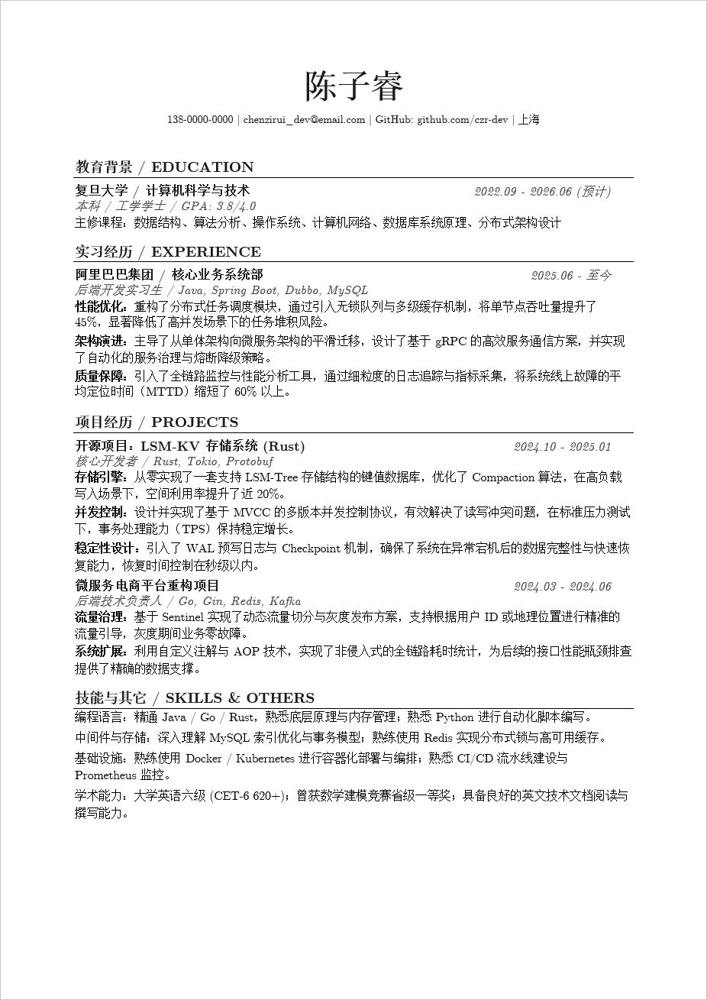
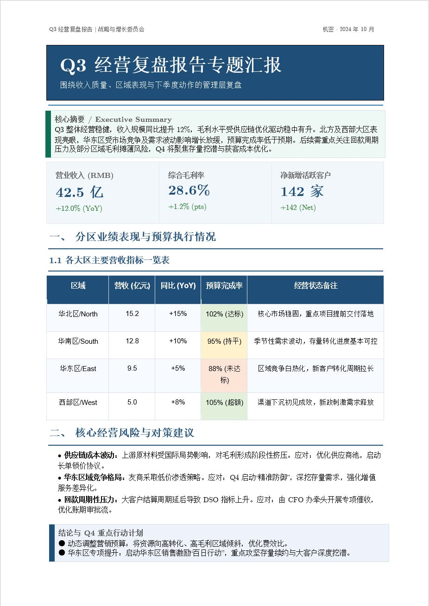

<p align="center">
  
</p>

<div align="center">

# Astrbot Office 助手

**让你的聊天bot能够生成office文件**

[](https://github.com/Clhikari/astrbot_plugin_office_assistant)
[](https://www.python.org/)
[](https://nodejs.org/)

</div>

---

## 目录

- [部分效果](#部分效果)
- [快速了解](#快速了解)
- [快速开始](#快速开始)
- [配置说明](#配置说明)
- [工具与命令](#工具与命令)
- [Word 工作流](#word-工作流)
- [支持的文件格式](#支持的文件格式)
- [系统依赖安装](#系统依赖安装)
- [Docker 部署](#docker-部署)
- [常见问题](#常见问题)
- [后续规划](#后续规划)
- [交流](#交流)

---

## 部分效果

<table align="center" width="100%">
  <tr>
    <td align="center" width="50%">
      
    </td>
    <td align="center" width="50%">
      
    </td>
  </tr>
</table>

---

## 快速了解

- 群聊默认不启用（`enable_features_in_group=false`），启用后需要 @ 机器人才暴露工具。
- 指令支持中英文别名，比如 `/pdf_status` 和 `/pdf状态`。
- 群聊里先上传文件、后面再处理，用 `/doc` 系列命令更顺手。
- 插件生效时会自动隐藏 `astrbot_execute_shell` 等执行类工具。
- 默认只能访问工作区内路径，可配置放开。
- 复杂 Word 走四步链：`create_document → add_blocks → finalize_document → export_document`，支持封面、正文、列表、表格、图片、目录等。

---

## 快速开始

### 1. 安装插件和 Node

通过 AstrBot 插件管理器安装，Python 依赖会自动装好。

Word 导出走 JS 渲染器，机器上需要 Node.js（建议 18+），先确认 `node -v` 能跑。

### 2. 构建 Word JS 渲染器

第一次部署或拉了新代码后，在插件目录里构建一次：

```powershell
cd word_renderer_js
npm install
npm run build
```

构建完会生成 `word_renderer_js/dist/cli.js`，没这个文件 Word 工具链没法导出。

### 3. 检查状态

- `/fileinfo`：看插件运行状态和配置
- `/pdf_status`（或 `/pdf状态`）：看 PDF 转换是否可用

### 4. 试一下

- 发个 `.txt` 或 `.md` 给机器人，让它读取并总结
- 让机器人生成一个 `.xlsx`
- 装了转换依赖的话，试一次 Office → PDF

---

## 配置说明

在 AstrBot 管理面板中设置。常用的几项：

| 配置项 | 默认值 | 什么情况下改 |
| --- | --- | --- |
| `enable_features_in_group` | `false` | 要在群聊里用插件 |
| `require_at_in_group` | `true` | 群聊里不想强制 @ |
| `enable_docx_image_review` | `true` | 不需要模型读 Word 里的图片 |
| `auto_block_execution_tools` | `true` | 不想自动隐藏执行类工具 |
| `allow_external_input_files` | `false` | 要读工作区外的文件 |
| `enable_pdf_conversion` | `true` | 不需要 Office/PDF 转换 |
| `auto_delete_files` | `true` | 想保留生成的文件 |
| `word_style_settings.default_font_name` | 空 | 想统一改 Word 默认字体，比如 Arial |

<details>
<summary>完整配置表</summary>

### 触发设置（`trigger_settings`）

| 配置项 | 类型 | 默认值 | 说明 |
| --- | --- | --- | --- |
| 群聊需要@/引用机器人 (`require_at_in_group`) | bool | true | 群聊中 @ 或引用机器人时才暴露文件工具 |
| 群聊启用插件功能 (`enable_features_in_group`) | bool | false | 关了的话群聊里插件完全不生效 |
| 自动屏蔽 shell/python 工具 (`auto_block_execution_tools`) | bool | true | 插件生效时隐藏 `astrbot_execute_*` 系列工具 |
| 发送文件时@用户 (`reply_to_user`) | bool | true | 发文件时是否 @ 发起人 |

### 权限管理（`permission_settings`）

| 配置项 | 类型 | 默认值 | 说明 |
| --- | --- | --- | --- |
| 用户白名单 (`whitelist_users`) | list | [] | 允许使用插件的用户 ID，留空则仅管理员可用 |

### 功能开关（`feature_settings`）

| 配置项 | 类型 | 默认值 | 说明 |
| --- | --- | --- | --- |
| 启用 Office 文件生成 (`enable_office_files`) | bool | true | 是否允许 `create_office_file` |
| 启用 PDF 转换 (`enable_pdf_conversion`) | bool | true | 是否允许 Office ↔ PDF 转换（需系统依赖） |

### 文件限制（`file_settings`）

| 配置项 | 类型 | 默认值 | 说明 |
| --- | --- | --- | --- |
| 最大文件大小MB (`max_file_size_mb`) | int | 20 | 读取和发送的大小上限 |
| 启用 Word 图片理解 (`enable_docx_image_review`) | bool | true | 读 `.docx` 时把嵌入图片注入上下文，关了就按纯文本读 |
| Word图片注入大小上限MB (`max_inline_docx_image_mb`) | int | 2 | 单张图超过这个大小就跳过 |
| Word图片最多注入张数 (`max_inline_docx_image_count`) | int | 3 | 最多注入几张图到上下文 |
| 发送后自动删除文件 (`auto_delete_files`) | bool | true | 发完就删，关了就留在工作区 |
| 文件合并等待时间秒 (`message_buffer_seconds`) | float | 4 | 上传文件后等一会儿，把同一波的文件合在一起 |
| 旧流程文本缓存时间秒 (`recent_text_ttl_seconds`) | int | 20 | 主要影响"文件和文字一起进来"的老用法，一般不用动 |
| 上传文件保留时间秒 (`upload_session_ttl_seconds`) | int | 600 | 上传完文件后在当前会话里保留多久，供 `/doc` 命令使用 |

### 路径访问（`path_settings`）

| 配置项 | 类型 | 默认值 | 说明 |
| --- | --- | --- | --- |
| 允许外部绝对路径 (`allow_external_input_files`) | bool | false | 放开后 `read_file` 和转换工具可以访问工作区外路径，删除不受影响 |

### 预览图（`preview_settings`）

| 配置项 | 类型 | 默认值 | 说明 |
| --- | --- | --- | --- |
| 启用预览图 (`enable`) | bool | true | 发 Office/PDF 时带首页预览图 |
| 预览图分辨率 (`dpi`) | int | 150 | 推荐 100~200 |

### Word 默认样式（`word_style_settings`）

| 配置项 | 类型 | 默认值 | 说明 |
| --- | --- | --- | --- |
| 正文默认字体 (`default_font_name`) | string | 空 | 模型没显式指定字体时使用，比如 `Arial` |
| 标题默认字体 (`default_heading_font_name`) | string | 空 | 留空时跟随正文默认字体 |
| 表格默认字体 (`default_table_font_name`) | string | 空 | 留空时跟随正文默认字体 |
| 代码默认字体 (`default_code_font_name`) | string | 空 | 留空时继续使用内置默认值 |

</details>

---

## 工具与命令

### LLM 工具

| 工具名 | 干什么 |
| --- | --- |
| `read_file` | 读文本、代码、Office、PDF 的内容 |
| `create_office_file` | 生成 Word / Excel / PPT（Word 建议走四步链） |
| `create_document` | 新建 Word 草稿 |
| `add_blocks` | 往草稿里加内容 |
| `finalize_document` | 锁定草稿 |
| `export_document` | 导出 .docx，自动发给用户 |
| `convert_to_pdf` | Office → PDF |
| `convert_from_pdf` | PDF → Word 或 Excel |

### 插件命令

| 命令 | 别名 | 干什么 |
| --- | --- | --- |
| `/list_files` | `/file_ls`, `/文件列表` | 看工作区里的 Office 文件 |
| `/delete_file <文件名>` | `/file_rm`, `/删除文件` | 删工作区里的文件 |
| `/fileinfo` | 无 | 看运行状态和配置 |
| `/pdf_status` | `/pdf状态` | 看 PDF 转换是否可用 |
| `/doc list` | 无 | 看当前会话里的上传文件 |
| `/doc clear [文件ID]` | 无 | 清空会话文件，或只删一个 |
| `/doc use [文件ID...] 你的要求` | 无 | 选文件继续处理 |

### `/doc` 用法

主要给群聊用。先上传文件，再决定拿哪几个往下处理。

```
/doc list
/doc clear
/doc clear f1
/doc use f1 根据这份文件整理成正式汇报
/doc use f1 f2 根据这些文件整理成正式汇报
```

会话里只有一个文件时可以省略文件 ID：

```
/doc use 根据这份文件整理成正式汇报
```

文件按"平台 + 会话 + 用户"隔离，群里其他人的文件不会混进来。

---

## Word 工作流

先建草稿，一块一块填内容，最后锁定导出。适合周报月报、管理层汇报、简历、带表格和图的报告这些东西。

### 流程

1. `create_document`：建草稿，定主题、表格模板、密度、强调色
2. `add_blocks`：往里加内容，可以多次调用
3. `finalize_document`：锁定，之后不能再追加
4. `export_document`：导出 .docx，自动发文件和预览图

```
┌───────────────────────────┐
│     create_document       │
│                           │
│  theme_name               │
│  table_template           │
│  density                  │
│  accent_color             │
└─────────────┬─────────────┘
              │
              ▼
┌───────────────────────────┐
│       add_blocks          │◄──┐
│                           │   │
│  page_template hero_banner│   │
│  heading      paragraph   │   │
│  list         table image │   │ 可多次调用
│  summary_card accent_box  │   │
│  metric_cards page_break  │   │
│  section_break toc        │   │
│  group       columns      │   │
└─────────────┬─────────────┘   │
              │ 内容完成        │
              │─────────────────┘
              ▼
┌───────────────────────────┐
│   finalize_document       │
│       锁定草稿            │
└─────────────┬─────────────┘
              │
              ▼
┌───────────────────────────┐
│    export_document        │
│  导出 .docx + 自动发送    │
└───────────────────────────┘
```

### 可选配置

- 主题：`business_report`、`project_review`、`executive_brief`
- 表格样式：`report_grid`、`metrics_compact`、`minimal`
- 排版密度：`comfortable`（宽松）或 `compact`（紧凑）
- 强调色：`accent_color=RRGGBB`
- 卡片变体：`summary` 或 `conclusion`
- 页面模板：`business_review_cover`（经营复盘封面）、`technical_resume`（技术简历）
- 段落和表格支持富文本（粗体、斜体、下划线、颜色、字体、超链接等）和边框
- 表格支持两层表头（`header_groups`）
- 支持页眉页脚（首页不同、奇偶页不同）、分节、目录

### 注意

- 中途出错别续旧草稿，重新来一份更稳。
- 想参考旧版内容，先上传旧文档让模型提取，再用提取结果生成新的。

> [!TIP]
> 提示写清楚效果会好很多：文档给谁看、要哪些章节、哪些内容用表格或卡片、语气正式还是简洁、排版宽松还是紧凑。

---

## 支持的文件格式

### 可读取

- Office：`.docx` `.xlsx` `.pptx` `.doc` `.xls` `.ppt`
- PDF：`.pdf`
- 文本和代码：`.txt` `.md` `.log` `.rst` `.json` `.yaml` `.yml` `.toml` `.xml` `.csv` `.html` `.css` `.sql` `.sh` `.bat` `.py` `.js` `.ts` `.jsx` `.tsx` `.c` `.cpp` `.h` `.java` `.go` `.rs`

### 可生成

`.docx` `.xlsx` `.pptx`

### PDF 转换

| 方向 | 依赖 | 说明 |
| --- | --- | --- |
| Office → PDF | Windows: `docx2pdf` / `pywin32`（要装 Office）；或 LibreOffice | Word / Excel / PPT 都能转 |
| PDF → Word | `pdf2docx` | 文本型 PDF 效果好一些 |
| PDF → Excel | `tabula-py`（要 Java）或 `pdfplumber` | 抽表格为主，复杂版面会丢东西 |

---

## 系统依赖安装

> [!NOTE]
> Python 包自动装。下面是系统层面需要自己装的东西。

| 平台 | 读旧 `.doc` | Office → PDF | 怎么选 |
| --- | --- | --- | --- |
| Windows | `pywin32` | Word 用 `docx2pdf`，Excel/PPT 用 `pywin32` 或 LibreOffice | 有 Office 就用 `docx2pdf` + `pywin32`，没有就装 LibreOffice |
| Linux | `antiword` | LibreOffice | 装 LibreOffice 就行 |
| macOS | `antiword` | LibreOffice | `brew install` |

> [!TIP]
> 不确定缺什么，跑 `/pdf_status` 就知道了。

<details>
<summary>各平台安装命令</summary>

### Windows

```bash
# 旧格式读取 + win32com 转换
pip install pywin32

# Word 转 PDF
pip install docx2pdf
```

也可以装 LibreOffice 当跨平台转换后端：<https://www.libreoffice.org/download/>

### Linux（Debian/Ubuntu）

```bash
# 读 .doc
apt install antiword

# Office -> PDF
apt install libreoffice-writer libreoffice-calc libreoffice-impress
```

### macOS

```bash
# 读 .doc
brew install antiword

# Office -> PDF
brew install --cask libreoffice
```

</details>

> [!TIP]
> 装完记得重启 AstrBot。

---

## Docker 部署

写进 Dockerfile，镜像重建也不丢：

```dockerfile
RUN apt-get update && apt-get install -y \
    antiword \
    libreoffice-writer libreoffice-calc libreoffice-impress \
    && rm -rf /var/lib/apt/lists/*
```

<details>
<summary>进容器手装（临时）</summary>

```bash
docker exec -it <容器名> bash
apt-get update
apt-get install -y antiword
apt-get install -y libreoffice-writer libreoffice-calc libreoffice-impress
```

容器删了重建得重装。

</details>

---

## 安全说明

- 默认只能访问插件工作区。开了外部路径也只放开读取和转换，删除不受影响。
- 群聊默认关闭，按需开。白名单留空 = 仅管理员可用。
- 大文件超限直接拒绝，纯文本超出分块上限会截断并提示。

---

## 常见问题

### 群聊里插件没反应？

`enable_features_in_group` 默认 `false`，打开它。如果还需要去掉 @ 限制，把 `require_at_in_group` 也关了。

### 私聊看不到文件工具？

查白名单。留空只有管理员能用。

### 没有预览图？

三种可能：`preview_settings.enable` 关了；缺 `pymupdf`；Office 预览目前只支持 Windows 上的 Word。

### PDF → Excel 出来是空表或者乱的？

PDF → Excel 是抽表格的，扫描件、跨页表格、复杂版面都容易出问题。换一份干净的 PDF，或者装 Java + `tabula-py` 试试。

### Office → PDF 失败？

跑 `/pdf_status` 看缺什么。Windows 上 Word 要 Office + `docx2pdf`，Excel/PPT 要 Office + `pywin32`；Linux/macOS 装 LibreOffice。

---

## 后续规划

### Word

- [x] 合并单元格和跨列表头
- [x] 局部字体/颜色/边框
- [ ] 脚注/尾注
- [x] 超链接
- [x] 页码格式（罗马数字等）

### Excel

- [x] 独立的工作簿/工作表模型，支持 `create_workbook -> write_rows -> export_workbook`
- [ ] 覆盖大多数新建报表场景：多工作表、表头、分批写入、导出
- [ ] 补齐常用报表格式：列宽、冻结窗格、自动筛选、数字格式、条件格式
- [ ] 增加已有 `.xlsx` 的读取与续写能力，支持“先读后建”和基于现有文件继续生成
- [ ] 高级能力按需补充：公式、图表、复杂模板编辑

### PPT

- [ ] 独立的演示文稿模型
- [ ] 标题页、内容页、结论页

---

## 交流

遇到问题或者有想法，来群里聊：QQ 群 `1072198212`

---

## Star History

[](https://star-history.com/#Clhikari/astrbot_plugin_office_assistant&Date)

## 许可证

AGPL-3.0

## 贡献

项目架构见 [docs/architecture.md](docs/architecture.md)。

欢迎提 Issue 和 PR。涉及行为变更的话附上复现步骤和预期结果。
