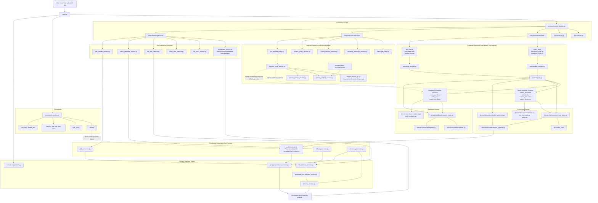

# 项目架构

```mermaid
flowchart TB

  U["User request or uploaded files"] --> M["main.py"]

  subgraph L2["Runtime Assembly"]
    RB["services/runtime_builder.py"]
    RT["app/runtime.py"]
    ST["app/settings.py"]
    PRB["PluginRuntimeBundle"]
    RPS["RequestPipelineServices"]
    FPS["FileProcessingServices"]
  end

  M --> RB
  RB --> RT
  RB --> ST
  RB --> PRB
  RB --> RPS
  RB --> FPS

  subgraph L3["Request Ingress And Prompt Pipeline"]
    MB["message_buffer.py"]
    IMS["incoming_message_service.py"]
    USS["upload_session_service.py"]
    APS["access_policy_service.py"]
    LLM["llm_request_policy.py"]
    RHS["request_hook_service.py"]
    RFU["request_follow_up.py<br/>request_hook_notice_helpers.py"]
    PCS["prompt_context_service.py"]
    UPS["upload_prompt_service.py"]
    PS["prompts/static, prompts/scenes"]
  end

  RPS --> MB
  RPS --> IMS
  RPS --> USS
  RPS --> APS
  RPS --> LLM
  LLM --> RHS
  RHS --> RFU
  RHS --> PCS
  RHS --> UPS
  PS --> PCS

  subgraph CMD["Commands"]
    CS["command_service.py"]
    FI["/fileinfo"]
    PDFS["/pdf_status"]
    DOC["/doc list, /doc use, /doc clear"]
    FILES["/list_files, /delete_file"]
  end

  M --> CS
  CS --> FI
  CS --> PDFS
  CS --> DOC
  CS --> FILES

  subgraph L4["Capability Exposure And Shared Tool Registry"]
    AG["agent_tools<br/>document_tools.py<br/>workbook_tools.py"]
    AA["tools/astrbot_adapter.py"]
    REG["tools/registry.py"]
    MA["tools/mcp_adapter.py"]
    MCP["mcp_server<br/>document tools<br/>workbook tools"]
    WC["Word Workflow Contract<br/>create_document<br/>add_blocks<br/>finalize_document<br/>export_document"]
    WB["Workbook Workflow Contract<br/>create_workbook<br/>write_rows<br/>export_workbook"]
  end

  PRB --> AG
  PRB --> MCP
  AG --> AA --> REG
  MCP --> MA --> REG
  REG --> WC
  REG --> WB

  subgraph DD["Document Domain"]
    DC["document_core"]
    DS["domain/document/session_store.py"]
    DB["domain/document/contracts.py<br/>tool_contracts.py<br/>hooks.py"]
    EP["domain/document/export_pipeline.py"]
    RCFG["domain/document/render_backends.py"]
  end

  WC --> DS
  WC --> DB
  REG --> DS
  REG --> RCFG
  DS --> DC
  DS --> EP
  RCFG --> EP

  subgraph WD["Workbook Domain"]
    WS["domain/workbook/session_store.py"]
    WCT["domain/workbook/contracts.py<br/>tool_contracts.py"]
    WM["domain/workbook/models.py"]
    WE["domain/workbook/exporter.py"]
  end

  WB --> WS
  WB --> WCT
  REG --> WS
  WS --> WM
  WS --> WE

  subgraph FP2["File Processing Services"]
    WSS["workspace_service.py<br/>workspace + spreadsheet text extraction"]
    FRS["file_read_service.py"]
    WRS["word_read_service.py"]
    FTS["file_tool_service.py"]
    OGS["office_generate_service.py"]
    PCS2["pdf_convert_service.py"]
  end

  FPS --> WSS
  FPS --> FRS
  FPS --> WRS
  FPS --> FTS
  FPS --> OGS
  FPS --> PCS2

  subgraph RV["Rendering Conversion And Preview"]
    WRJ["word_renderer_js<br/>Primary backend for complex Word rendering"]
    OG["office_generator.py"]
    PDFC["pdf_converter.py"]
    PV["preview_generator.py"]
  end

  EP --> WRJ
  OGS --> OG
  PCS2 --> PDFC

  subgraph DL["Delivery And Post Export"]
    DSV["delivery_service.py"]
    GFD["generated_file_delivery_service.py"]
    FDS["file_delivery_service.py"]
    PEH["post_export_hook_service.py"]
    EHS["error_hook_service.py"]
  end

  FTS --> FDS
  GFD --> DSV
  FDS --> GFD
  OG --> FDS
  PDFC --> FDS
  WRJ --> PEH
  PV --> DSV
  PV --> PEH
  M --> EHS

  OUT["Workspace And Exported Artifacts"]

  WSS --> OUT
  DSV --> OUT
  PEH --> OUT

  FI -. shows Node renderer status .-> WRJ
  RHS -. injects workflow guidance .-> WC
  RHS -. injects workbook guide and follow-up notice .-> WB
```
